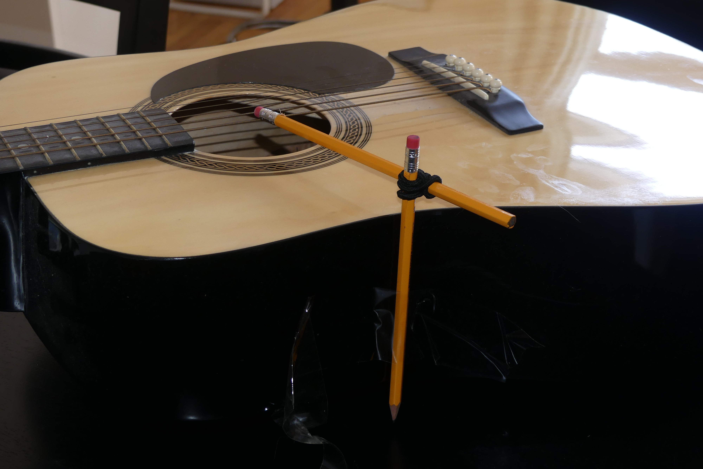

## Lab 1: No-tech Puppeteering

### Introduction

Just indirectly move something 1 mm, 10 mm, and 100 mm, easy right?
Well...it depends. It would be much easier if there were more materials
and if I actually owned a metric measuring tape, but there are still
plenty of interesting things to do!

Of course, I do have to treat 1 mm, 10 mm, and 100 mm more as guidelines
than specific measurements, at least until customary measuring tape
manufacturers mark down to 0.04 in.

### Goals

The goal of this lab is to create 3 sketches that move at the scale of 1 mm, 10 mm, and 100 mm.
The sketches should fall in the minutes and hours level of sketching described by Camille Moussette.
In other words, the sketches should be quick and dirty approaches coming from brainstorming using
what's available. With the additional stipulation that the prototyping should take 3 hours total,
the level is more "minutes and hour" than "minutes and hours".

### Brainstorming

Since I don't have many mechanical things to play around with and restrictions mean I can't just go to a dollar store to buy things, the first issue was identifying some ways to cause movement and store energy.
The first idea for something that stores energy is hair ties as the elastic can be stretched, storing energy, and when free to move will exert force on something attached to this.
Another more interesting source would be a can of compressed air used for cleaning. Since the air inside is under pressure, that can be released with the air exerting a force on whatever is in front of the nozzle.

After that I hit what seemed to be a dead end since I didn't have much else obvious in terms of building supplies. That wasn't a problem following a lab where it was mentioned that we could use non-mechanical approaches as well.
People mentioned using steam, melting, and other things to cause the motion.
This opened some doors for me because while I don't have a lot of tools and hardware supplies around, I
do have food and things for cooking.
While some foods don't change all that much when cooked or prepared, some absolutely move.
Bread rises, rice absorbs water, popcorn pops. There are certainly some interesting ways
of getting motion with things in the kitchen.

### Sketches

#### 1 mm

On the scale of 1 mm, I ended up making two examples.
The first consisted of two pencils, a hair tie, tape, and an acoustic guitar.
One pencil was attached to the guitar's body with tape and the other pencil
was attached to it with the hair tie. The hair tie was wound so the elastic was twisting
one end of the second pencil towards a guitar string.

Pressing on the other end of the pencil
would raise the hammer part and releasing would cause the hammer end of the hammer to strike
the string. The string would deform on the scale of 1 mm and a sound would also be produced.
From ideation to the version shown here, it took approximately 45 minutes of work.

<video width="100%" controls>
  <source src="../assets/lab1/Guitar 1mm.webm" type="video/webm">
</video>

The second sketch came about accidentally as a result of a 100 mm sketch.
Popcorn kernels were placed in a pot with hot oil. While the popping itself
will be discussed more later, sometimes steam will leak out of the kernels and
move them slightly. In the recording below, kernels can be seen moving on the scale of 1 mm.

<video width="100%" controls>
  <source src="../assets/lab1/Popcorn 1mm.webm" type="video/webm">
</video>

#### 10 mm

The first sketch moving at the scale of 10 mm involves moving a washer supported by a nut on a screw.
The screw was fixed to a desk using sticky tack which, while not very stable, did do the job.
The nut was turned counter-clockwise to move it down the screw. The washer was then pulled down to the new point by gravity.

<video width="100%" controls>
  <source src="../assets/lab1/Washer 10mm.webm" type="video/webm">
</video>

Pulling on a hair tie was used to twist the nut. While I tried to find a good way to keep the hair tie from not moving away from the nut, I wasn't able to find a solution that worked while respecting the level of prototyping. I did try using sticky tack to keep the tie on the nut, but the sticky tack would move during the twisting too much and cease to act as a guide.

A second sketch was attempted at this scale using the motion of a basil plant after being watered and a light overhead turned on.
I treat the light here as a storage device since it provides energy to the plant while the water is used to absorb nutrients and provide internal water pressure.
So over the course of an hour or so, the plant moves towards the light about 1 cm aided by the water.

#### 100 mm

At the 100 mm scale the popcorn returns. The pot featured in the earlier clip is about 10 cm tall.
So when the steam builds up in the kernel and it finally pops, that explosive force propels it to the top of the pot where it is then stopped by the lid, resulting in 10 cm of movement from that action.
Of course, that's fairly difficult to see when the pot is covered by a lid, so the clip here is with the pot uncovered.
Without the lid to stop it, the newly popped popcorn flies away from the pot.

<video width="100%" controls>
  <source src="../assets/lab1/Popcorn.webm" type="video/webm">
</video>

A second sketch is done using a sourdough starter. Over four hours after feeding the starter with 70 g each of water and flour, the yeast present in it produced carbon dioxide causing the starter to bubble and grow in volume in the glass I keep it in. A time lapse of this was recorded.

  <video width="50%" controls>
    <source src="../assets/lab1/Starter.mp4" type="video/mp4">
  </video>

Bubbles can be seen (slowly) rising through the starter and bursting at the top as well. 
### Reflections

While I feel this first lab went well and I ultimately was able to create movement through some different ways, I definitely didn't end up taking the kind of approach expected.
A Rube Goldberg machine was given as the example of what would happen if the goals of this lab were
done on a week-based sketching level, but I've never heard of one using plants and popcorn before.
I wouldn't mind doing this sort of activity again in a real lab rather than my home-based lab which is better equipped for dinner than prototyping machines.

That being said, the restrictions of this lab ended up making me look for movement and sources of energy in places I didn't initially think of. The lab lists "grow" and "explode" as ways to move, and while that might be difficult in some approaches they're natural when working with a plant or popcorn. It's harder to control plant-based motion than gear-based motion and I doubt I'll be using it for anything anytime soon, but this different approach brought me to different results than I'd otherwise have reached.
