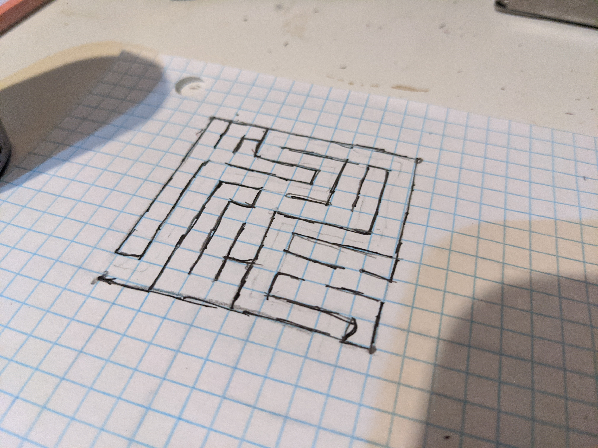

## Lab 2: Intro to Haply

### Setting Up the Haply

I set up the Haply using the provided assembly video. Ultimately using my own T6 screwdriver greatly helped
putting all the components together compared to the key provided.
From there I flashed it with the provided firmware and began running the Hello Wall example.

In the Hello Wall example, some of the nonideal behaviors of the Haply started occurring.
For example, oscillations would start to occur in the force feedback if I wasn't holding the end
effector steady enough. It was quite fun to play around with, but sudden reactions of the device that
don't match with the scenario of a ball being moved around and hitting a wall were surprising and sometimes
scary (especially when the motors were loud).
That being said it was fun to play around with the wall, adjust its features, and feel the results.

### Designing a Maze

I first started by sketching a maze out on a 10-by-10 grid.
This was done by breaking the square into subareas, drawing a path through them
and then creating the walls that create the maze.
From there the number of walls were counted up to determine how many assets would need to be drawn
in the Haply environment.
A picture of this sketch is included below.



From there I worked on rendering the maze walls using the Hello Wall example from [the Getting Starting repository](https://github.com/HaplyHaptics/Getting-Started).
Since the walls of the sketch are lines, it made sense to me to try and implement them using the
`FLine` class in Fisica.
However I realized I made a mistake after testing with two lines; the way the lines are implemented
result in them only exerting force in one direction. If the Haply's avatar approaches from one side
it provides an opposing force, but from the other the force pushes the end effector through.
Needless to say, this is not how a maze works.

<!-- TODO: Add a gif of this happening here -->

As the `FBox` class had already been shown by the example to work, I decided to implement the maze walls using this class.
By this point the new 2DIY Haply information had been released, so I opened up the maze example there from [the learning examples](https://gitlab.com/Haply/2diy/learn).
After removing the existing box objects, I tried to add my own.
This presented a mild dilemma: I had points on a grid from the sketch of the maze, but I needed to convert that to a height and width of a box and then place that in a new space.
After reading the Fisica documentation and some trial and error, I realized that:

1. The width of each wall could be set to a predefined value I call `border`;
2. There is a fixed distance from the edge of the screen to the end of the edges established by Fisica, `edgeSize`; and
3. The `setPosition` function places the `FBox` objects according to their center, not the upper left point.

With this understanding I was able to make a system to automatically translate a multidimensional array `mazeBorder`
containing the coordinates of the endpoints of each wall in the grid notation to `FBox` elements in another array `boxes`.
The coordinates were multiplied by `incrementX` and `incrementY` values corresponding to the distance between grid points in the screen space. Barriers could then be added using the following for loop:

```java
for (int i = 0; i < mazeBorder.length; i++) {
  float[] barrier = mazeBorder[i];
  float sizeX = barrier[2] - barrier[0]; // x2 - x1
  float sizeY = barrier[3] - barrier[1]; // y2 - y1
  if (sizeX == 0) {
    sizeX = border;
  }
  if (sizeY == 0) {
    sizeY = border;
  }
  boxes[i] = new FBox(sizeX, sizeY);
  boxes[i].setPosition(
    edgeTopLeftX + edgeSize + barrier[0] + (sizeX/2),
    edgeTopLeftY + edgeSize + barrier[1] + (sizeY/2)
  );
  boxes[i].setFill(255); // Invisible on background
  boxes[i].setNoStroke();
  boxes[i].setStaticBody(true);
  world.add(boxes[i]);
}
```
From there, the start and stop circles were readjusted to the starting and ending points of the newly designed maze.
The flow of the program moves from the game being stopped, with the haptic avatar in sensor mode (no collision feedback)
and the maze hidden. Upon touching the green circle the game mode starts, the maze is visible, and the avatar
exits sensor mode.
Once the avatar clears the maze and reaches the red circle, the game mode finishes and the maze again disappears.

<video width="100%" controls>
  <source src="../assets/lab2/maze_video.mp4" type="video/mp4">
</video>

The source code for this maze can be downloaded [here](../assets/lab2/maze.zip).
