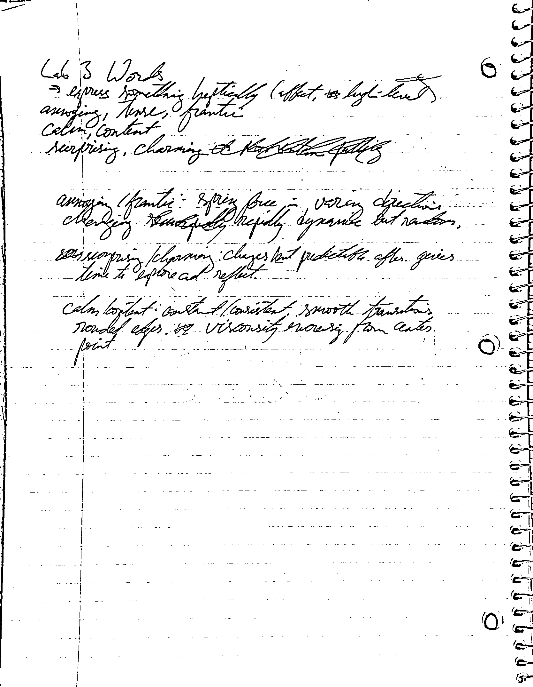
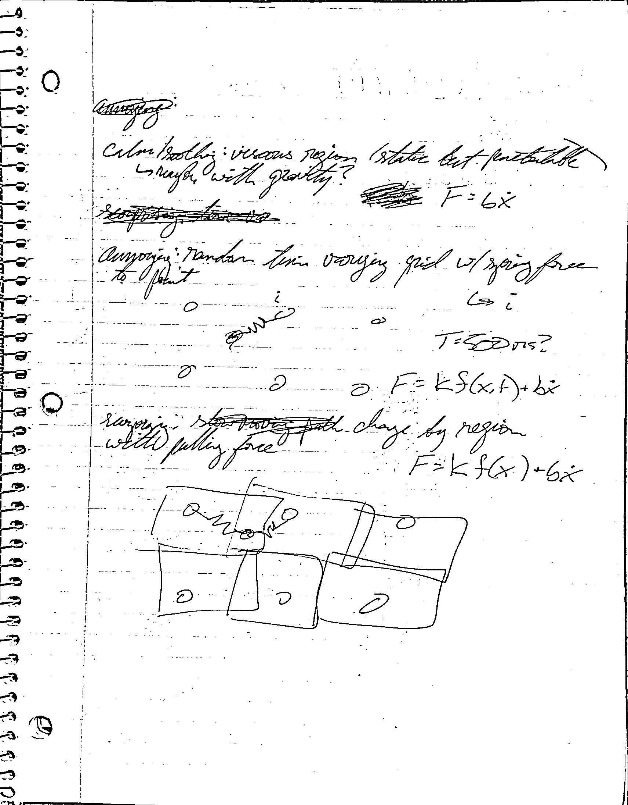

## Lab 3: Communicate Something with Haply

Thanks to Hannah E. and Rubia G. for testing!

### Pre-Implementation Planning

Prior to starting anything using Haply, I first started to come up with some ideas for what to express.
I understood the instructions as meaning that a high-level adjective should be conveyed rather than
doing something straightforward (e.g., having the end effector swirl around for "vortex").

{: width="50%" style="margin: 0 auto; display: block;"}
*Brief planning descriptions of the effects. These are elaborated on below.*{: style="display: block; text-align: center;"}

I ultimately ended up coming up with three concepts to convey. Taking from the image above:

* **annoying/frantic**: A spring force in varying directions changing rapidly. Dynamic but random.
* **surprising/charming**: Changes but predictable after. Gives time to explore and reflect.
* **calm/content**: Constant/consistent with smooth transitions. Something like rounded edges, viscosity moving
from a center point.

Working from these starting points, I made some pen and paper sketches of what the interactions might look like.

{: width="50%" style="margin: 0 auto; display: block;"}
*Initial rough descriptions and sketches for the ideas.*{: style="display: block; text-align: center; width: 75%; margin: auto;"}

The first basic sketch is for **calm/soothing**. This is described as being a static, viscous region.
The second is **annoying** which has a grid on the workspace of the Haply. A point on this grid is
randomly selected and a spring force is rendered from that point to the end effector. To make it especially
annoying, I decided the point should be updated every 500 ms.
The last is the surprising mode, which again uses a grid and spring forces. However rather than having
one point of the grid chosen randomly, all of them exert spring forces if the end effector is positioned
within a certain distance of it. The idea here is that the user would then try to explore the space and find the
different regions.

### Implemenation 1

#### Structure

The generic structure for a Haply program in Processing is followed in that a set of variables and constants are defined,
`setup` and `draw` functions are written, and a thread is spawned that handles physics simulation and the device.
For this app, Fisica was *not* used.

After some basic testing of the viscosity idea, I found that viscosity itself wasn't very compelling. Either it
was too strong or not really perceptible over the friction in the Haply itself. So, I tried setting the damping
factor to a small negative value to try and "help" along the end effector slightly when the user tries to move it.
My thinking is that by slightly reducing the apparent friction, the calm, smooth feeling would be conveyed.

A mode-based approach was taken to implement the three concepts. This was defined as
`enum Mode { CAL, ONE, TWO, THREE };` where `CAL` is calibration mode
(where a visual of the pantograph is shown and updated) and the other modes refer to the
numbered mode. In this case, mode one is calm, mode 2 is annoying, and mode 3 is surprising.

Values were set for the simulation building off of the "Hello Ball" example. Note that when different
adjectives the modes were supposed to convey were referred to in the code, they were hidden with ROT13
in case anyone testing decided to look through. The parameter setup is as follows:

```java
/** Generic Parameters */
float rEE = 0.006;
float rEEContact = 0.006;
float dt = 1 / 1000.0;
/** Mode 1 Parameters (fbbguvat) */
float bFluid = -2.5;
/** Mode 2 Parameters (naablvat) */
float tLastChange = Float.NEGATIVE_INFINITY;
float tDuration = 500; // ms
PVector[] locations2 = {
  new PVector(-0.07, 0.03), new PVector(0.07, 0.03),
  new PVector(-0.07, 0.07), new PVector(0.07, 0.07),
  new PVector(-0.07, 0.11), new PVector(0.07, 0.11)
};
float k2 = 220; // N/m
int index2;
/** Mode 3 Parameters (fhecevfvat) */
PVector[] locations3 = {
  new PVector(-0.07, 0.03), new PVector(0, 0.03), new PVector(0.07, 0.03),
  new PVector(-0.07, 0.07), new PVector(0, 0.07), new PVector(0.07, 0.07),
  new PVector(-0.07, 0.11), new PVector(0, 0.11), new PVector(0.07, 0.11),
};
float k3 = 220;  // N/m
float xThreshold = 0.025;   // m

/** State info */
PVector angles = new PVector(0, 0);
PVector torques = new PVector(0, 0);
PVector posEE = new PVector(0, 0);
PVector posEELast = new PVector(0, 0);
PVector velEE = new PVector(0, 0);
PVector fEE = new PVector(0, 0);

PVector deviceOrigin = new PVector(0, 0);
```

The physics rendering was implemented in the following run function:
```java
public void run() {
  renderingForce = true;
  if (haplyBoard.data_available()) {
    widget.device_read_data();
    angles.set(widget.get_device_angles());
    posEE.set(widget.get_device_position(angles.array()));
    posEE.set(device_to_graphics(posEE));
    velEE.set((posEE.copy().sub(posEELast)).div(dt));
    posEELast.set(posEE);

    // TODO physics
    PVector force = new PVector(0, 0);
    if (mode == Mode.ONE) {
      force.set((velEE.copy()).mult(bFluid));
    }
    else if (mode == Mode.TWO) {
      // Check if should update random spring loc
      if (millis() - tLastChange > tDuration) {
        index2 = int(random(0, locations2.length - 1));
        tLastChange = millis();
      }
      PVector xDiff = (posEE.copy()).sub(locations2[index2]);
      force.set(xDiff.mult(-k2));
    }
    else if (mode == Mode.THREE) {
      for (PVector loc : locations3) {
        // Check if within threshold
        PVector xDiff = (posEE.copy()).sub(loc);
        if (xDiff.mag() < xThreshold) {
          // Add force
          force.add(xDiff.mult(-k3));
        }
      }
    }

    fEE.set(graphics_to_device(force));
  }

  torques.set(widget.set_device_torques(fEE.array()));
  widget.device_write_torques();
  renderingForce = false;
}
```

#### Debugging

One extremely obvious issue is that if a force is being exerted when the program ends, the Haply will
keep rendering that force on the device. This comes up a lot in modes 2 and 3.
To solve this, another variable was defined `ScheduledFuture<?> handle;` that then gets the handle
for the scheduled haptics thread.
```java
handle = scheduler.scheduleAtFixedRate(st, 1, 1, MILLISECONDS);
```
Then the function run on exit in Processing was overridden to ensure
the last message sent to the Haply before closing was to set torques to 0.
```java
void exit() {
    handle.cancel(true);
    scheduler.shutdown(true);
    widget.set_device_torques(new float[]{0, 0});
    widget.device_write_torques();
    super.exit();
}
```

### Testing

A brief survey was included in the instructions in the [README](../assets/lab3/README.txt)
packaged with the sketch and dependencies.
Essentially, it asked the tester to list three adjectives for each of the modes in the order they are most
applicable. Testers were also asked to specify a separate list if they believed that the modes were trying
to convey something different, but failing to.

The feedback was as follows:

| Tester # | Mode 1 (Soothing) | Mode 2 (Annoying) | Mode 3 (Surprising) |
| ---      | ---               | ---               | ---                 |
| 1        | subtle, smooth, small | chaos, wild, random | checkered, jumpy, magnetic |
| 2        | viscous, grainy, free | violent, wild, random | restrained, checkered?, "holey"? |

### Reflection on First Attempt


### Conclusion
