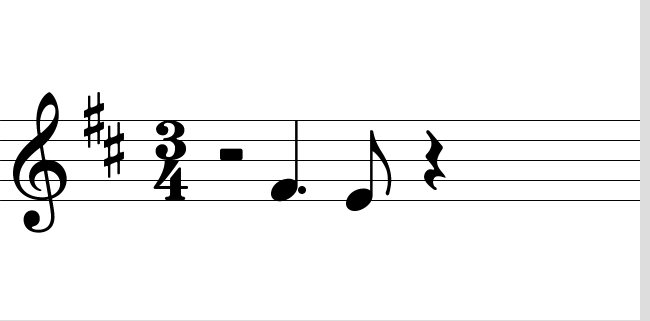

# Iteration 1: Making a Pretty Skeleton

This is a report on iteration 1 of Crescendo, a haptically-augmented music notation viewer.
In it, I'll explain what my team did generally, what I did specifically, and how it went.

## Team Iteration Goals

Our objectives for this iteration were to identify a set of interactions that should be haptically augmented,
begin iterating on haptic sketches for interactions with musical notation, and set up a software architecture
that we can iterate and build with as the project progresses.
These objectives came from two key motivations of ours: that we wanted to begin sketching and iterating early,
but also that our project is extremely multimodal and requires a flexible environment to work with.
To expand on the latter point, our plan for the project ends in coupling the visual music notation with
haptic feelings as the user goes through the written music and hears the notes playing at the same time.
The features we identified as being important to reinforce in our project proposal --- namely the harmonic
intervals between notes and the rhythm of a piece --- likely can only come together in a multimodal environment.
As such a good software framework to work from would, in our thinking, minimize the amount of time spent
rewriting later on and let us focus on design.

Since there is a fairly natural bifurcation in our objectives, we decided to approach each aspect in pairs
split by time zone.
Hannah and Rubia were to work on the haptic sketches while Sabrina and I were to work on the software
framework and basic design for the visuals and audio, which are important but not the focused modality.
Near the end of the iteration, some work was able to be integrated together to give a very rough multimodal experience.

Personally, I worked on:

1. Designing and implementing the architecture of the program in Processing such that we can iterate
on different ideas without significant rewriting;
2. Implementing must-have visual music notation in a way that the locations of each element
are known at runtime;
3. Beginning to integrate haptic effects designed by Hannah and Rubia; and
4. Developing a questionnaire that can be used in later iterations.

## Making Notes Appear and SMuFL

The first hurdle was being able to have any music notation be rendered in Processing while also
keeping the original positions of the notes available. Many tools (like [Verovio](https://www.verovio.org/))
allow exporting to an SVG that encodes elements in a way that can be found. This would also make working
with the resulting files relatively flexible.

The issue is that SVG support is extremely limited in Processing. It can load an SVG, but it cannot
load nested SVGs and it doesn't support reusing elements loaded from an SVG font file. These are critically
important in most ways music is encoded in SVGs, and implementing what's necessary to work around this
would be way too much work for the project.
Since rasterized images don't provide clear information about the elements, this left one option: display notation ourselves.

The next step was to use what many editors and engravers use under the hood: the Standard Music Font Layout or [SMuFL](https://www.smufl.org/).
SMuFL describes an interoperable way of making and using fonts for all kinds of music notation, and its
[specification](https://w3c.github.io/smufl/latest/index.html) is maintained by the W3C Music Notation Community Group.
Since Processing does allow for displaying text easily, it was straightforward to have individual glyphs
appear. For example, to display a G clef (which is encoded as unicode glyph U+E050) at some `(x, y)` position, the code required is just
`text("\ue050", x, y)` after loading a SMuFL font family. This approach was taken when implementing the architecture as described later on.

## Crescendo Architecture

Three design ideas were formed for the architecture of the software, each becoming more featured than the previous one.
The third idea is the one that was ultimately used as a reference for implementation.

### First Design

{: width="40%" style="margin: 0 auto; display: block;"}
*Class diagram of the first design idea.*{: style="display: block; text-align: center; width: 75%; margin: auto;"}

The first design idea was relatively simple. A score contains a set of notes, clefs, and rests.
Each of the notes, clefs, and rests are "renderable" and have a function that specifies their
visual (`visual_effect`), sound (`audio_effect`), and feel (`haptic_effect`).
In the case where an element doesn't influence that modality (e.g., rests don't make a sound) then the
function does nothing.

This idea gets to the basic concept, but leaves a lot ambiguous. The score does something and
all items are "renderable", but that means being "renderable" isn't an important distinction.
It's also unclear how much is shared between the classes and what the purpose of the score is other
than storage.

### Second Design

{: width="40%" style="margin: 0 auto; display: block;"}
*Class diagram of the second design idea adding more shared features between musical elements.*{: style="display: block; text-align: center; width: 75%; margin: auto;"}

The second design is a slight improvement over the first. While there is still a unified `Renderable` interface,
the three musical element classes are children of the `OrderedMusicElement` class contained by a `Score`.
These elements, naturally, contain an index representing their location in the score.

Another change was made in the `Note` with how it encodes pitch. The first design encoded pitch as an absolute
value (e.g., pitch as C4 or middle C). This means that the position of a note will depend on the clef preceding
it. Additionally if the accidental applies to the pitch, (e.g., pitch is C4 sharp) then the presence of
the accidental when rendering the note depends on the preceding key signature if any.
In this design, the choice was made to instead encode the position of the note on the score directly.
That is, a note that had pitch G4 in the previous design would now be encoded (when following a treble class)
as position 3, the third line or space from the bottom of the staff.
This does mean that determining pitch now requires context, however this could be found from querying the score.

However, this design still suffers from the ambiguity of `Renderable` as mentioned in the previous design.

### Third Design

{: width="100%" style="margin: 0 auto; display: block;"}
*Class diagram of the third design. Functionality for `Score` is specified along with helper enumerations and abstractions. The "renderable" is split by modality and musical elements implement them as needed.*{: style="display: block; text-align: center; width: 75%; margin: auto;"}

The third design adds content to the different classes but also splits the `Renderable` interface into three
interfaces --- `Viewable`, `Audible`, and `Tangible` --- corresponding to the three targeted sensory modalities.
For example, since every musical element recorded in musical notation can be seen, the `OrderedMusicElement`
class implements `Viewable`. However, only `Note` implements `Audible` since a clef and rest do not indicate
sound themselves.

Duration is represented as an abstract class to allow for interoperability between the visual representations
of duration in Western music notation (e.g., whole notes) and the actual representation of the note when
played at a tempo. This played duration depends not only on the shape of the note (or rest) and if it is dotted
(which indicates it is longer by the next smallest interval), but also the provided tempo and the time signature
of the measure.

Additionally, the way each modality is represented through the functions is clarified at this point.
The `force` function returns a vector representing the force exerted on the end effector by an element taking
into account the position of the end effector and any internal state variables the implementing class may have.
The `play` function returns an `AudioSample` that should be played at that time.
The `draw` function returns a `PShape` representing the musical element.
So far, the `play` and `draw` functions had to be modified in light of ease of implementation.
The `play` function will likely need to check if it should begin playing a sound and, if so, play the waveform
in a separate thread to not halt program execution.
Likewise, a drawn element likely consists of many different elements and it is better for the `draw` function
to directly add the elements to the screen rather than return them to a calling function.

### Implementation

The source code for this version can be found on [the boilerplate branch of our git repository](https://github.com/JRegimbal/crescendo/tree/boilerplate).
Most of the structure follows from the structure shown in the class diagram for the third design with
some notable additions and changes that are explained below.
The benefit of heavily applying object oriented programming is that creating a simple score is
relatively easy, and the functions to create output are all called iteratively by the `Score`.
For example, `score.draw()` calls the `draw` function for every element and displays them on the sketch.

After Hannah and Rubia finished a sketch only containing some haptic interactions, these could be
implemented using the `force` functions on the `Note` class. So, to make a little bump caused by pushing
the end effector through a note, the function was implemented as:
```java
PVector force(PVector posEE, PVector velEE) {
  PVector posDiff = (posEE.copy().sub(this.getPhysicsPosition()));
  final float threshold = 0.005;
  if (posDiff.mag() > threshold) {
    return new PVector(0, 0);
  }
  return new PVector(-1.1, -1.1);
}
```
This is a very simple example, but can be extended with more complicated physical models and states internal
to the note or score itself.

## Putting It All Together

The goals for the software base and layout is that notation can be quickly added to a Processing sketch
and it will look good enough for a prototype. The next lines of code
```java
Score s;
Clef c;
TimeSignature t;
Rest r, r1;
Note n, n1;

void setup() {
  size(640, 320);
  s = new Score();
  c = new Clef(s, ClefShape.G, KeySignature.DMaj);
  t = new TimeSignature(s, 3, 4);
  r = new Rest(s, BaseDuration.HALF);
  // Make a new quarter note that is dotted and one space up from the first staff line
  n = new Note(s, BaseDuration.QUARTER, true, 1);
  // Make a new eighth note on the first staff line
  n1 = new Note(s, BaseDuration.EIGHTH, 0);
  r2 = new Rest(s, BaseDuration.QUARTER);
}

void draw() {
  background(255);
  s.draw();
}
```
result in this visual for the user:


Adding in use of the Haply (which can be seen in the `boilerplate.pde` and `Panto.pde` files in the repository)
results in an overlay of a pantograph where force is rendered when the end effector intersects with a note.


At the time of writing (March 5, 2021), the audio support added by Sabrina is being finished and integrated.

## Questionnaire

The point of all this coding was to make it easier to iterate on the different modalities together going
forward. Of course, we need to evaluate the different prototypes by some set of criteria.
After discussing some practical criteria in a meeting (e.g., people should be able to tell the difference
between melodic intervals) I set out to begin creating a rough questionnaire we can use to evaluate
later on and guide our designs.

The subjects drew heavily from the class reading [Defining Haptic Experience: Foundations for Understanding, Communicating, and Evaluating HX](https://doi.org/10.1145/3313831.3376280).
Specifically, I tried to capture the usability requirements and some of the experiential dimensions.
Since this is meant for early testing, harmony and expressivity were included while autotelics was not.
Since it doesn't model a real interaction, realism is left out. Immersion should be included later once
we have designs mature enough that more useful questions can be formulated.
The questionnaire can be viewed [as a PDF](../assets/iter1/questionnaire.pdf).

## Reflection and Going Forward

From my view, this iteration was a qualified success. The code base seems ready to allow us to design
a bit more rapidly and actually test our ideas with all modalities together. This is undoubtedly going
to be a powerful benefit, especially since a significant problem designing in this iteration is difficulty
designing effects when they can't be experienced in context. While this was primarily noted by Hannah and
Rubia, who focused on the haptics, it was felt by the group together. Sabrina and I tested the sketches
created by Hannah and Rubia and even we noted that while it seemed to feel good, it was hard to evaluate without
proper visuals or audio feedback.

Even while forming the questionnaire this problem was felt. The main features of musical notation we want to
reinforce are the location of notes on the staff and the rhythm of the piece. As was mentioned in our proposal,
a common mistake made by dyslexic music students is that they mistake notes for being on an adjacent line or
space within the staff. Additionally, there has been research that shows that music studies reinforcing rhythm
help improve the reading ability of children with dyslexia. So reinforcing both these features of music would,
hypothetically, help the user in and outside of music. While the transpositions have a fairly obvious
connection to haptics, rhythm doesn't. And while we spent time as a group thinking of ways it could be
reinforced using the Haply, ultimately we probably don't need to. Actually *playing* the notes would likely
be far more effective than any haptic solution and it would keep clashes from occurring in haptic simultaneous
haptic melodic signals and haptic rhythmic signals.

Effective communication was also a challenge during this iteration. This isn't surprising---the difficulty
of communicating haptic designs verbally is well known---but interestingly this didn't only affect the haptic
component directly. Our ideal endpoint for this project has different modes and features with the main division
being an exploration mode, where the user can explore the score nonlinearly at their own pace, and a
tempo-driven mode, where the user experiences the notated music linearly at the notated pace. In trying to
communicate ideas for haptic interactions, there were often misundertandings about which use case the
interaction was for. The purpose would seem obvious to the speaker, but sometimes others in the team would
believe it was obviously something else. I was guilty of this myself! This suggests we need to adopt a bit more
verbosity in our communications, even if that does feel a bit strange on Discord.

For our next iteration, we plan on implementing and testing various interaction ideas and then deciding on ones
to refine. Our current plan is to sketch out different multimodal haptic ideas over a few days and then meet
to discuss. At that point we will go over the different ideas, identify common features, and then divide work
on implementing some of them. The actual number of sketches to bring to a prototyping stage depends on how
much of a feature overlap there is between them. We plan on rapidly iterating over designs in this next phase.
