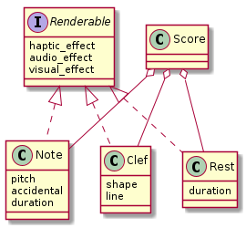
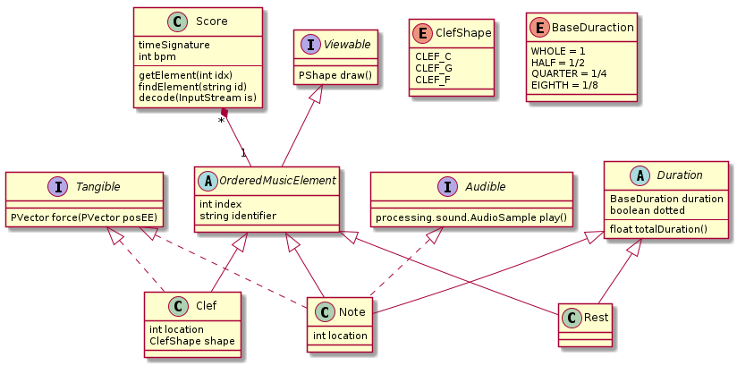
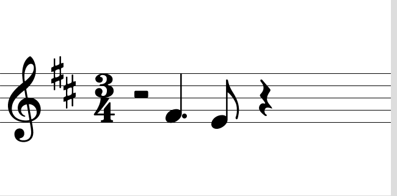

# Iteration 1 Contribution

## Team Iteration Goals

Our objectives for this iteration were to identify a set of interactions that should be haptically augmented,
begin iterating on haptic sketches for interactions with musical notation, and set up a software architecture
that we can iterate and build with as the project progresses.
These objectives came from two key motivations of ours: that we wanted to begin sketching and iterating early,
but also that our project is extremely multimodal and requires a flexible environment to work with.
To expand on the latter point, our plan for the project ends in coupling the visual music notation with
haptic feelings as the user goes through the written music and hears the notes playing at the same time.
The features we identified as being important to reinforce in our project proposal --- namely the harmonic
intervals between notes and the rhythm of a piece --- likely can only come together in a multimodal environment.
As such a good software framework to work from would, in our thinking, minimize the amount of time spent
rewriting later on and let us focus on design.

Since there is a fairly natural bifurcation in our objectives, we decided to approach each aspect in pairs
split by time zone.
Hannah and Rubia were to work on the haptic sketches while Sabrina and I were to work on the software
framework and basic design for the visuals and audio, which are important but not the focused modality.
Near the end of the iteration, some work was able to be integrated together to give a very rough multimodal experience.

Personally, I worked on:

1. Designing and implementing the architecture of the program in Processing such that we can iterate
on different ideas without significant rewriting;
2. Implementing must-have visual music notation in a way that the locations of each element
are known at runtime;
3. Beginning to integrate haptic effects designed by Hannah and Rubia; and
4. Developing a questionnaire that can be used in later iterations.

## Crescendo Architecture

Three design ideas were formed for the architecture of the software, each becoming more featured than the previous one.
The third idea is the one that was ultimately used as a reference for implementation.

### First Design

{: width="40%" style="margin: 0 auto; display: block;"}
*Class diagram of the first design idea.*{: style="display: block; text-align: center; width: 75%; margin: auto;"}

The first design idea was relatively simple. A score contains a set of notes, clefs, and rests.
Each of the notes, clefs, and rests are "renderable" and have a function that specifies their
visual (`visual_effect`), sound (`audio_effect`), and feel (`haptic_effect`).
In the case where an element doesn't influence that modality (e.g., rests don't make a sound) then the
function does nothing.

This idea gets to the basic concept, but leaves a lot ambiguous. The score does something and
all items are "renderable", but that means being "renderable" isn't an important distinction.
It's also unclear how much is shared between the classes and what the purpose of the score is other
than storage.

### Second Design

{: width="40%" style="margin: 0 auto; display: block;"}
*Class diagram of the second design idea adding more shared features between musical elements.*{: style="display: block; text-align: center; width: 75%; margin: auto;"}

The second design is a slight improvement over the first. While there is still a unified `Renderable` interface,
the three musical element classes are children of the `OrderedMusicElement` class contained by a `Score`.
These elements, naturally, contain an index representing their location in the score.

Another change was made in the `Note` with how it encodes pitch. The first design encoded pitch as an absolute
value (e.g., pitch as C4 or middle C). This means that the position of a note will depend on the clef preceding
it. Additionally if the accidental applies to the pitch, (e.g., pitch is C4 sharp) then the presence of
the accidental when rendering the note depends on the preceding key signature if any.
In this design, the choice was made to instead encode the position of the note on the score directly.
That is, a note that had pitch G4 in the previous design would now be encoded (when following a treble class)
as position 3, the third line or space from the bottom of the staff.
This does mean that determining pitch now requires context, however this could be found from querying the score.

However, this design still suffers from the ambiguity of `Renderable` as mentioned in the previous design.

### Third Design

{: width="100%" style="margin: 0 auto; display: block;"}
*Class diagram of the third design. Functionality for `Score` is specified along with helper enumerations and abstractions. The "renderable" is split by modality and musical elements implement them as needed.*{: style="display: block; text-align: center; width: 75%; margin: auto;"}

The third design adds content to the different classes but also splits the `Renderable` interface into three
interfaces --- `Viewable`, `Audible`, and `Tangible` --- corresponding to the three targeted sensory modalities.
For example, since every musical element recorded in musical notation can be seen, the `OrderedMusicElement`
class implements `Viewable`. However, only `Note` implements `Audible` since a clef and rest do not indicate
sound themselves.

Duration is represented as an abstract class to allow for interoperability between the visual representations
of duration in Western music notation (e.g., whole notes) and the actual representation of the note when
played at a tempo. This played duration depends not only on the shape of the note (or rest) and if it is dotted
(which indicates it is longer by the next smallest interval), but also the provided tempo and the time signature
of the measure.

Additionally, the way each modality is represented through the functions is clarified at this point.
The `force` function returns a vector representing the force exerted on the end effector by an element taking
into account the position of the end effector and any internal state variables the implementing class may have.
The `play` function returns an `AudioSample` that should be played at that time.
The `draw` function returns a `PShape` representing the musical element.
So far, the `play` and `draw` functions had to be modified in light of ease of implementation.
The `play` function will likely need to check if it should begin playing a sound and, if so, play the waveform
in a separate thread to not halt program execution.
Likewise, a drawn element likely consists of many different elements and it is better for the `draw` function
to directly add the elements to the screen rather than return them to a calling function.

### Implementation

The source code for this version can be found on [the boilerplate branch of our git repository](https://github.com/JRegimbal/crescendo/tree/boilerplate).
Most of the structure follows from the structure shown in the class diagram for the third design with
some notable additions and changes that are explained below.
The benefit of heavily applying object oriented programming is that creating a simple score is
relatively easy. An example of the main Processing sketch is shown after the discussion of rendering.

#### New Features from Class Diagram

* Time signature, key signature

#### Changes from Class Diagram

## Visual Rendering and Layout

### SMuFL and Music Fonts

### Basic Layout Rules

## Putting It All Together

The goals for the software base and layout is that notation can be quickly added to a Processing sketch
and it will look good enough for a prototype. The next lines of code
```java
Score s;
Clef c;
TimeSignature t;
Rest r, r1;
Note n, n1;

void setup() {
  size(640, 320);
  s = new Score();
  c = new Clef(s, ClefShape.G, KeySignature.DMaj);
  t = new TimeSignature(s, 3, 4);
  r = new Rest(s, BaseDuration.HALF);
  // Make a new quarter note that is dotted and one space up from the first staff line
  n = new Note(s, BaseDuration.QUARTER, true, 1);
  // Make a new eighth note on the first staff line
  n1 = new Note(s, BaseDuration.EIGHTH, 0);
  r2 = new Rest(s, BaseDuration.QUARTER);
}

void draw() {
  background(255);
  s.draw();
}
```
result in this visual for the user:


## Adding Basic Haptics Support

## Questionnaire

## Conclusion
