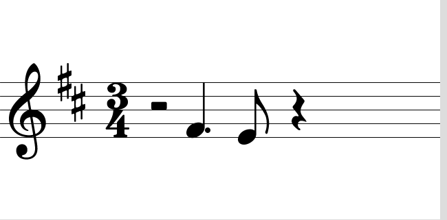
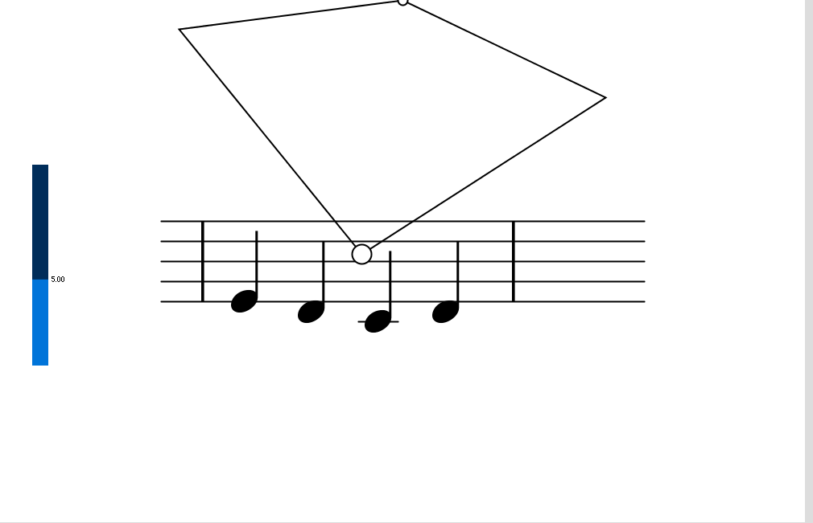

# Iteration 2: Notes and Notches

The code shown in this iteration can be found on the [proto-staff branch](https://github.com/JRegimbal/crescendo/tree/proto-staff).

## Project Background

Our project is Crescendo, a haptically-augmented musical score meant to help people with
dyslexia learn to read music notation. [Raarsma, Ruijssenaars, and Van den Broeck](https://doi.org/10.1007/s11881-998-0007-4)
found that children with dyslexia struggle especially with transpositions in pitch within the staff lines.
Additionally note shapes, which impact duration, should be reinforced.
Our overall goal is to reinforce this information through force-feedback with the Haply and audio, following similar multimodal methods used in language reading (for an example, see [Oakland et al.](https://doi.org/10.1177%2F002221949803100204)).

## Previously in Iteration 1...

Much of our work in iteration 1 was focused on basic exploration of ideas for the haptic component of
the project and developing a software framework to use as a base going forward.
Rubia and Hannah focused on haptic designs while Sabrina and I focused on the software framework, including
the visual and audio components. At the end of iteration 1, rough versions of audio, haptics, and visuals were
available together with easy ways to adjust each of them. For more information, see [the blog post for iteration 1](./iteration1).

## Iteration Goals

Our objectives for this iteration were to finalize our interaction model for the software, iterate on a set
of haptic effects, and begin testing so we can work towards a ``final'' version for the course.
Our motivation primarily is to move through the design funnel quickly. Since the end of the project in the scope
of the course is rapidly approaching, we need to quickly identify what seems to work best so those features
can be refined.

Specifically, the interaction model refers to how we expect a user to use the software. For example, how a user
can move between parts of a score that aren't visible or reachable on screen.
The iterations of haptic effects were again split by time zone between Hannah and Rubia, and Sabrina and myself.
Hannah and Rubia's focus was on textures within the notes to reinforce note shape and duration in addition
to the audio playing when a note is passed over.
Sabrina and I focused on ways to communicate vertical position and orient users within the workspace.
More detail on how the interaction model was designed and the haptic effects I specifically worked on
are discussed later.

## Work I Was Involved In

### Interaction Model

Early in the iteration, all four of us held a meeting to go over the sketches we made after iteration 1.
These sketches included ideas of specific interactions, for example, being guided from note to note via the
Haply, and general ways of presenting the music notation as a whole.
When it comes to presenting music notation, we have a few requirements any solution must meet:

1. It must allow a user to move back and forth across notation and not strictly move a user ahead.
2. The user must be able to move the end effector from one note to another without necessarily feeling
forces from notes in between. For example, when moving from one measure to the next.

These seem simple, but our two main interfaces of a sliding "piano roll" (think Guitar Hero but horizontal and for musical notation)
and separated discrete measures did not provide both. In this meeting, we realized that the real world equivalent of tracing along with a piece using a finger or pencil would likely involve the reader *lifting* off
the page. While we can't literally do this with the Haply, we can model it using an engage/disengage feature
where interactions with the music, whether audio or haptic, do not occur when the end effector is in the
disengaged mode.
We also decided that breaking up a score into individual measures, combined with this approach, would better
support skipping around as one would on a page.

While these discussions were held as a group, I was responsible for implementing the changes in software so that
as we developed our prototypes we could be working from the same interaction model. Visual rendering
was rewritten to support different measures (previously all notation was rendered in a single line),
the shift key was mapped to engage/disengage, and the [ControlP5](http://www.sojamo.de/libraries/controlP5/)
introduced in the PID lab was used to scroll through a variable number of measures.
The up and down arrow keys can also be used to control it. Pictured below are the interface at the end of
iteration 1 and the interface after these changes were made.

Iteration 1 Interface | New Interface
:--------------------:|:----------------:
 | 

### Improved Note Sounds

During a discussion with our mentors, Oliver and Pourang, the question was raised if using non-enveloped pure sine waves as the audio component would be pleasant to the user.
Naturally, the answer was that it likely wouldn't be.
Since I was familiar with Pure Data, a software suggested by Oliver, I worked on improving the sound component.
The rationale behind this change is to increase the hedonistic value of Crescendo so it is more pleasant to use
and ideally users will be more inclined to keep using it.

I created a synthesizer using addative synthesis in Pure Data that summed sine waves at the first few harmonics of a note. This synthesizer received [Open Sound Control](https://en.wikipedia.org/wiki/Open_Sound_Control)
messages of the form `/crescendo/play FREQUENCY DURATION`.
This indicated to the Pure Data patch to play a note of
frequency `FREQUENCY` for `DURATION` milliseconds, passing it through an attack-decay-sustain-release (ADSR)
envelope. These messages were sent from Processing using the [`oscP5`](www.sojamo.de/libraries/oscP5/) library.
The built-in commands for parsing these messages were used in Pure Data. Currently the patch requires
the user to start Pure Data separately to allow more flexibility in adjusting the synthesizer, but
I intend to use the Pure Data bindings for Processing later on to make the software easier to use.

<video width="100%" controls>
<source src="../assets/iter2/new_interface.webm" type="video/webm">
</video>

### Meeting with Karon and Rethinking the Staff

Early on, Sabrina and I scheduled a meeting with Karon to discuss the forces that should be present within
the staff. While forces on the staff lines had been considered from the beginning, at this point we were mainly
focusing on a small amount of haptic guidance to help lead the user to the next note, however we were not
sure how to implement this given requirement 1 mentioned above.
However, Sabrina and I were convinced that this would be a necessary feature to add to the software to reinforce
vertical position.

Thankfully, Karon quickly reminded us that in our focus on guidance we had overlooked three important facts:
people have a remarkably poor sense of proprioception when guided haptically, improved performance with
guidance does not necessarily translate outside of that environment, and the Haply is not particularly suited
to the small nuanced forces we imagined between notes in the small workspace.
Our conversation lead to two main approaches for haptically conveying information on vertical position and
thus pitch using the Haply. One focused on discrete events tied to staff lines and the other focused on
larger, global forces to help provide an absolute sense of one's position within the staff.
From here, Sabrina and I each went to work on making our own implementations of these.

### Spring Model and Notch Model

My two implementations created a spring model to convey global position and a "notches" to indicate the staff
lines.
The spring was implemented so that it was on the first ledger line above the staff. It only exerted force along
the y-axis when the end effector was below the first ledger line under the assumption that most notes would not
go above that point.
The function `globalStaffForce` was implemented in the Score's force rendering loop as:
```java
private PVector globalStaffForce(PVector posEE, PVector velEE) {
  final float posY = (marginVertical - lineSpacing) / pixelsPerMeter;
  final float k = 80; // N/m
  // Only come into effect if end effector is below line
  PVector force = new PVector(0, 0);
  if (posEE.y - posY > 0) {
    force.y = -k * (posEE.y - posY);
  }
  return force;
}
```
The spring constant `k` was tuned to a point so that to me it felt sufficiently strong but not so much it would be difficult to control the end effector below the staff lines.

A few different versions were tried for the discrete staff line bumps. At first, it was simply implemented as opposing force in the direction of movement with a deadband for small velocities of the end effector.
However, this was difficult to tune and often lead to oscillations about the lines.
This was particularly troubling since the user needs to move over notes on staff lines and do so easily.
This was adjusted to modeling the bump as a semicircle about the center of the line.
This lead to a more stable interaction, but still at the boundary of the semicircle the force exerted
went from 0 to whatever the force value was tuned to, again leading to undesirable behavior around the
staff line.

The final version I settled on for this iteration used a smooth Gaussian function about the staff lines.
These were chosen so that there would not be a hard boundary between no force and force and hopefully that
it would be more stable when the end effector was near a staff line.
The function for this was again added to the force loop for the Score as:
```java
private PVector staffForce(PVector posEE, PVector velEE, PShape line) {
  PVector linePos = getPhysicsPosition(line);
  PVector force = new PVector(0, 0);
  final float epsilon = 1000;
  final float fmax = 2;
  float gaussian = (float) Math.exp(-Math.pow(epsilon * (posEE.y - linePos.y), 2));
  force.y = fmax * gaussian * Math.signum(posEE.y - linePos.y);
  return force;
}
```
The term `Math.signum(posEE.y - linePos.y)` was added so the direction of the force would go from the staff
line to the end effector.
Boolean terms were added to allow turning these forces on and off easily and then Sabrina tested them and her own
implementations with her family members.

## Sabrina's User Testing and Reflection

Sabrina, using a modified version of the questionnaire from iteration 1 that omitted questions related to
haptic effects on notes, had her family members evaluate our implementations both focusing on the
haptic effects alone by muting the sound and hiding the window, and the full experience including the visuals
and sound.
An edited version of the tests is [available on YouTube](https://www.youtube.com/watch?v=ogh7KNzVjsI).

These tests provided the first feedback we had outside of the team.
As we expected, the presence of visuals and audio greatly improved the experience compared to a haptic
score alone. Alone, it was unsurprisingly difficult for people to recognize what it was supposed to be.
It was mentioned that the pleasant sounding notes added to the experience, validating our desire to
increase the hedonic value of the experience across the different modalities.
Discrete forces along staff lines were typically appreciated while the global force going across the staff
interfered with the other haptic effects, especially where it was stronger at the bottom of the staff.

Many issues were noted, of course. Some are fairly easy to solve, like notes repeating automatically
if the end effector stays above it. Others are harder to tackle, like the note that it was difficult for
some people to know what they were actually supposed to do with the device.
One possible way to handle this that we intend to try is to "nudge" the end effector towards the next note
when passing over the previous one. How this would work with the textures on notes being tested by Hannah and Rubia would need to be tested.

There are probably three main takeaways from this iteration. The first is that using multimodality improved the
experience. People tended to better understand and enjoy the experience more when presented all the sensory
stimuli we designed. This suggests our approach of reinforcing information across modalities and trying to
increase the hedonics of the visual and audio modalities is helping, at least so far.

The second is that there is a high variety in how people experienced and understood the prototypes.
Some were able to understand what was happening quickly and find the relationships between the different
stimuli, while others found it hard to control and confusing. While this hopefully will get better with
more revisions and tuning of interactions and parameters, it is concerning to get uncertain feedback.
We will likely continue on the general path we are on for now, but with only a few tests that didn't involve people
who fall into our intended user group, it is hard to objectively evaluate our designs.

This leads into the third takeaway: I, and possibly others in the group, are too involved in our tasks and may
be developing a kind of tunnel vision. Earlier on, I mentioned that I fully believed that implementing some
sort of path guidance would be necessary for the project, only to be told conflicting information that I already
knew but did not successfully apply. Since this project is being done remotely, we all work on separate but
related tasks and do not have other people around to just be aware of what we are doing or provide another
viewpoint in quick, informal ways. Even with my own iterating on designs, I still am forming my own conceptions
about what the project "should" do that aren't sufficiently grounded.

Going forward, I personally need to make more of an active effort to have other people outside of the group test my work and challenge my ideas. As a team, iteration 3 is the point where we are finally going to work towards
a single prototype.
So far we have tried to split up tasks by time zone to try and accomplish more than if we were all focused on
the same short-term goal and still have someone to collaborate with. At this point, we intend to combine
the note textures developed by Hannah and Rubia with the methods of communicating position within the staff
developed by Sabrina and myself. In integrating everything together, we need to test variations with people unfamiliar (or at least less familiar) with our work to ensure we are creating a project that is usable and hopefully
enjoyable by most people and not just by the people who designed it.
